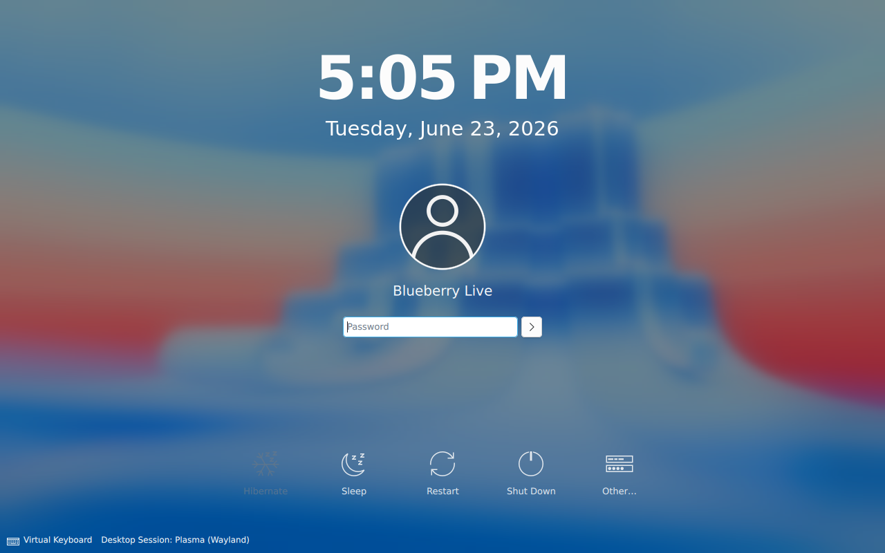
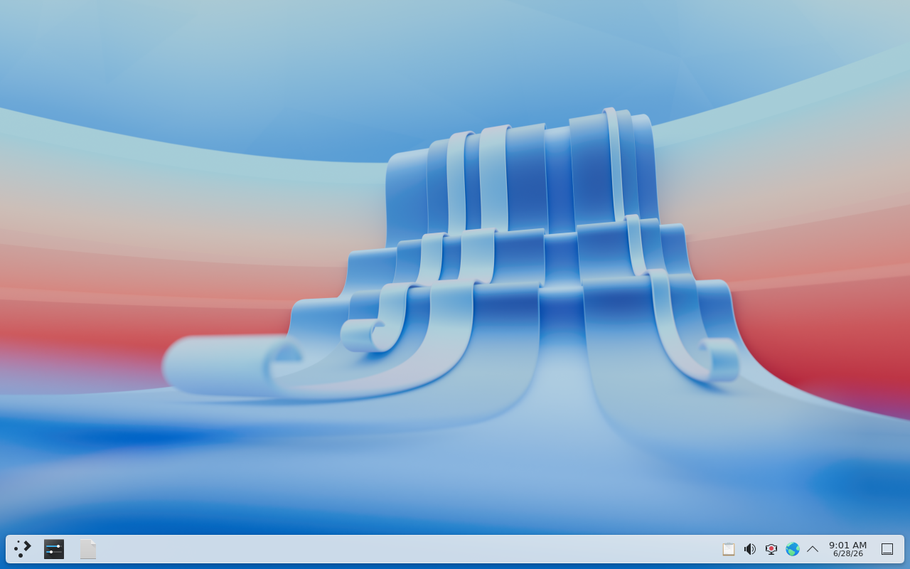
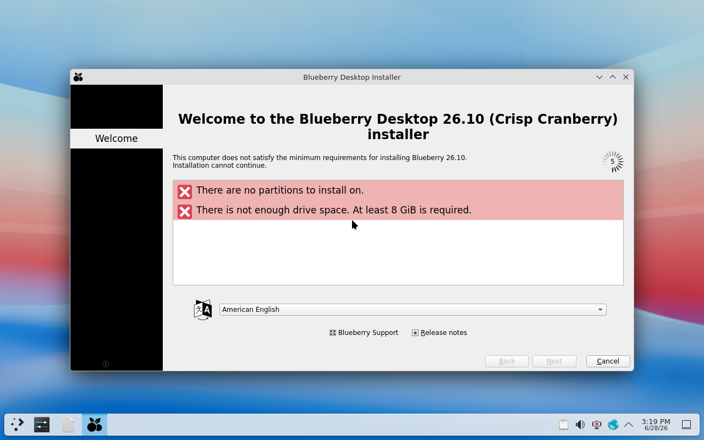

# Installing Blueberry Desktop

Blueberry Desktop installs from a **live ISO**: you boot into a real KDE Plasma
session, try the system, and then run **the Blueberry installer** to install it. Nothing is
written to disk until you finish the installer.

## 1. Get the ISO

Download a release ISO, or build one:

```sh
make desktop-iso                 # KDE Plasma (default)
make desktop-iso DE=gnome        # GNOME spin
# → iso/blueberry-desktop-<version>-kde-x86_64.iso
```

Write it to a USB stick (replace `sdX` with your device):

```sh
sudo dd if=iso/blueberry-desktop-*.iso of=/dev/sdX bs=4M status=progress oflag=sync
```

Or test it in a VM — `make run-desktop` is the easy path:

```sh
make run-desktop
# equivalent to:
qemu-system-x86_64 -enable-kvm -cpu host -m 4G -smp 4 \
  -cdrom iso/blueberry-desktop-*.iso -vga virtio \
  -drive file=blueberry-disk.qcow2,if=virtio,format=qcow2   # disk to install onto
```

> **`-cpu host` is required.** The live desktop renders with software OpenGL
> (Mesa llvmpipe), which needs AVX; the default `qemu64` CPU lacks it and the
> screen stays black.

> **Attach a disk, or the installer has nowhere to go.** A CD-only VM makes
> the Blueberry installer report *"There are no partitions to install on / not enough drive
> space"* — there is simply no disk. `make run-desktop` creates and attaches a
> persistent 20 GB `qcow2` for you (override with `BLUEBERRY_DISK` /
> `BLUEBERRY_DISK_SIZE`); after installing, boot the result by swapping `-boot d`
> for `-boot c`. Rolling your own `qemu` line? Create the disk first with
> `qemu-img create -f qcow2 blueberry-disk.qcow2 20G` and add the `-drive` above.

## 2. Boot the live session

The ISO boots through GRUB → kernel → initramfs, which mounts the squashfs root
as a read-only lower layer with a tmpfs upper layer (so the live session is
writable but disposable). systemd reaches `graphical.target` and **SDDM shows
the KDE Plasma (Wayland) greeter** — log in as **`live`** (no password).



Once logged in you get a full KDE Plasma 6 (Wayland) session — wallpaper, panel,
launcher, and system tray:



> **Try before you install.** Wi-Fi, trackpad, display scaling, sound — verify
> them in the live session. What works live will work installed.

## 3. Run the Blueberry installer

The installer **launches automatically** a few seconds into the live session. If
you closed it, reopen it from the launcher as **Install System** (or run
`/usr/local/bin/blueberry-install`). It needs no password — the live session is
pre-authorized.



the Blueberry installer walks you through:

1. **Welcome** — language.
2. **Location** — region & timezone (auto-detected where possible).
3. **Keyboard** — layout.
4. **Partitions** — *Erase disk* (guided), *Replace a partition*, or *Manual*
   (a full KDE-Partition-Manager-style editor, backed by `kpmcore`). Supports
   ext4, btrfs, swap, and an EFI system partition on UEFI.
5. **Users** — your name, username, hostname, password, and whether to log in
   automatically.
6. **Summary** — review every change. **Nothing has been written yet.**
7. **Install** — the Blueberry installer unpacks the squashfs to the target, installs GRUB,
   writes `fstab`, creates your user, and enables services, with a slideshow
   while it runs.
8. **Finish** — reboot into your installed system.

## 4. First boot

Your installed system boots GRUB → **pinned kernel** → systemd → SDDM → Plasma.
Log in with the account you created.

Update userspace any time:

```sh
bpm update && bpm upgrade
```

Remember: on Desktop, `bpm upgrade` updates apps and userspace but **not the
kernel** — that comes with the next release. See [The Kernel Model](The-Kernel-Model).

## Troubleshooting

- **Black screen after login (live):** try the *nomodeset* GRUB entry, or the
  X11 session from the SDDM session menu.
- **the Blueberry installer won't start:** open Konsole and run `sudo calamares -d` to see a
  debug log.
- **No network in the Blueberry installer:** connect Wi-Fi from the Plasma system tray first;
  the installer uses the live session's connection.

More in [Troubleshooting](Troubleshooting). Installer internals are in
[The the Blueberry installer Installer](The-the Blueberry installer-Installer).
